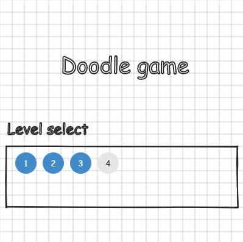

## Table of contents
* [General info](#general-info)
* [Technologies](#technologies)
* [Features](#features)
* [TODO](#TODO)
* [Installation](#installation)
* [Screenshots](#screenshots)

## General info
Dodge game made using p5.js library. Use arrows to move.
	
## Technologies
Project is created with:
* p5.js/p5.dom/p5.collide2D

## Features
* Implemented first level of the game
* Usable objects - Turrets/Walls
* Death count

## TODO
* More levels 
* Better menu
* More objects

## Installation
* Clone the repository
* Run file index.html

## Screenshots

### Homepage

### Level

