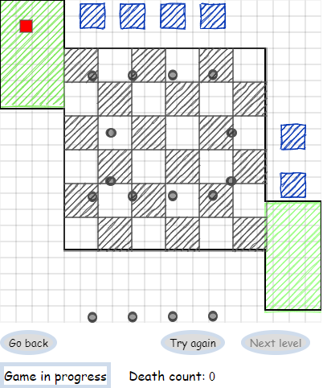

## Table of contents
* [General info](#general-info)
* [Technologies](#technologies)
* [Features](#features)
* [TODO](#TODO)
* [Installation](#installation)
* [Screenshots](#screenshots)

## General info
Dodge game made using p5.js library. Use arrows to move.
	
## Technologies
Project is created with:
* p5.js/p5.dom
* p5.collide2D - https://github.com/bmoren/p5.collide2D
* p5.scribble - https://github.com/generative-light/p5.scribble.js
* js.cookie https://github.com/js-cookie/js-cookie

## Features
* Welcome screen and first 2 levels
* Unlockable levels
* Saving user progress in cookies
* Usable objects - Turrets/Walls/Moving circles
* Death count

## TODO
* More levels 
* More objects

## Installation
* Clone the repository
* Run file index.html

## Screenshots

### Homepage

### Level 1

